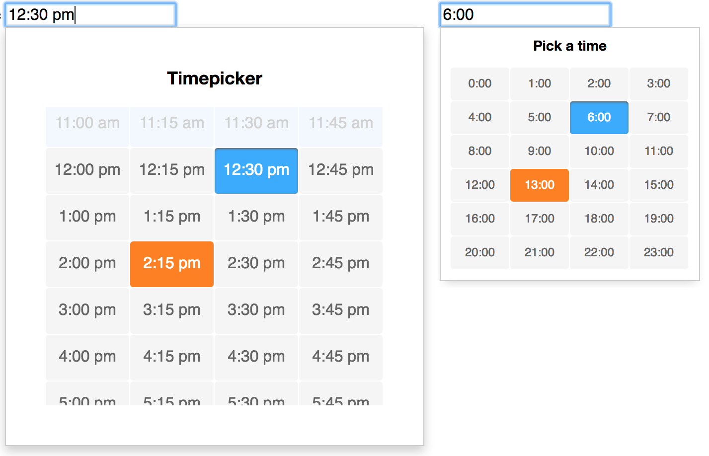

# Appointment Picker

A lightweight, accessible and customizable javascript timepicker widget

## Yet another timepicker? - Advantages
 - no dependencies
 - tiny (6KB minified, 2KB gzipped)
 - only the listed times can be picked or entered, no validation necessary
 
<p>
  
</p>

<a href="https://jannicz.github.io/appointment-picker/">
  <strong>See Appointment-Picker Demo and Examples</strong>
</a>

## Installation
```
npm i -S appointment-picker
```

## Setup
When using inside a static HTML file, add both the stylesheet and the script
```html
<link rel="stylesheet" href="css/appointment-picker.css">
<script src="js/appointment-picker.min.js"></script>

<script type="text/javascript">
    new AppointmentPicker(...);
</script>
```

## Import
When using with a module loader, import the node-module

```js
// Webpack (React, Angular, ES6)
import AppointmentPicker from 'appointment-picker';

// CommonJS (Node, Browserify)
const AppointmentPicker = require('appointment-picker');
```

Initialize the picker using the `new` keyword
```html
<input id="time" type="text" value="10:00">
```
```js
var picker = new AppointmentPicker(document.getElementById('time'), {});
```

## Options
The appointment-picker can be configured with options
- `interval` sets the interval between appointments in minutes (`1-60`), if this number gets lower (more possible appointments) the picker will get longer
- `mode` the picker can be used in standard `24h` hour mode or in `12h` mode - the latter uses am/pm postfix
- `minTime` sets the minimum hour that can be picked, default is `0` what is eqivalent to 12am
- `maxTime` sets the maximum hour that can be picked, default is `24`
- `startTime` hides all appointments below this hour, default is `0`
- `endTime` hides all appointments above this hour, default is `24`
- `disabled` array of disabled appointments, i.e. `['10:30', '1:15pm', ...]` - these times cannot be selected or entered and will be skipped using the keyboard arrows
- `large` increases the size of the picker and the appointments by setting a `is-large` modifier
- `leadingZero` adds leading zero to single-digit hour if true (i.e. 07:15)
- `allowReset` whether a time can be reset once entered
- `title` defines the picker's heading
- `templateOuter` HTML template that renders the picker's outer frame (usually containing a wrapper and title), must contain `{{innerHtml}}` placeholder ([example](https://jannicz.github.io/appointment-picker/example/render-on-init.html))
- `templateInner` template for repeated list items (time inputs), must contain at least an `input` tag, `{{time}}` and optional `{{disabled}}` placeholder, i.e. `<input type="button" value="{{time}}" {{disabled}}>`
- `timeFormat24` custom time format for 24h mode (use placeholder `H` for hour, `M` for minute), i.e. `H/M` could evaluate to `13/45` ([example](https://jannicz.github.io/appointment-picker/#custom-time-format))
- `timeFormat12` custom time format for am/pm mode (use placeholder `apm` for postfix - the algorithm will remove either the a or the p from the pattern), i.e. `H.M AP.M.` could evaluate to `1.30 A.M`

__Note:__ with `startTime` and `endTime` appointments below and above can be visually removed. If startTime is greater than `minTime` a lower time can still be manually set via the keyboard. On the other hand the picker does not accept lower hours than `minTime` and higher than `maxTime`. Manually entered times outside of the defined bounds will be rejected by the picker, no extra validation is therefore needed. Entering an empty string into the input resets the time.

Now you can pass your options into the the AppointmentPicker invocation

```js
var picker = new AppointmentPicker(document.getElementById('time-2'), {
  interval: 30,
  mode: '12h',
  minTime: 09,
  maxTime: 22,
  startTime: 08,
  endTime: 24,
  disabled: ['16:30', '17:00'],
  templateInner: '<li class="appo-picker-list-item {{disabled}}"><input type="button" tabindex="-1" value="{{time}}" {{disabled}}></li>',
  templateOuter: '<span class="appo-picker-title">{{title}}</span><ul class="appo-picker-list">{{innerHtml}}</ul>'
});
```

## Methods
The appointment-picker exposes several functions to change its behaviour from outside ([example](https://jannicz.github.io/appointment-picker/example/exposed-functions.html)).

Method | Desc.
--- | ---
`picker.open()` | open the picker popup
`picker.getTime()` | get the current time programmatically from a picker instance, returns an object like `{ h: 14, m: 30, displayTime: '2:30 pm' }`
`picker.setTime('10:30')` | set a time of a picker instance (empty string resets the time)
`picker.close()` | close the picker popup
`picker.destroy()` | destroy the picker instance and remove both the markup and all event listeners

## Events
Appointment-picker exposes events for hooking into the functionality:

- `change.appo.picker` triggered on each successful value change ([event example](https://jannicz.github.io/appointment-picker/example/exposed-functions.html))
- `open.appo.picker` is fired each time the picker is opened
- `close.appo.picker` is fired each time the picker is closed

Each `event` contains 2 properties `time` and `displayTime`, i.e. `event.time: {'h':14,'m':30}` and `event.displayTime: '2:30 pm'`

```js
document.body.addEventListener('change.appo.picker', function(e) { var time = e.time; }, false);
```

## Styling
All appointment-picker styles are namespaced with `.appo-picker`, i.e. `.appo-picker-list-item`.
You can either copy and modify the provided CSS, or import it using

```css
/* Using sass/scss */
@import '~appointment-picker/css/appointment-picker';
```

or in your javascript file

```js
// Using a css-loader inside JS (relative path to your node_modules folder)
import '../node_modules/appointment-picker/css/appointment-picker.css';
```

## Accessibility

For screen reader support add both a `aria-label` and `aria-live` properties on the input field
```html
<input id="time-1" type="text" aria-live="assertive" aria-label="Use up or down arrow keys to change time">
```

## Browser Support
- Chrome
- Firefox
- Safari (macOS 10 & iOS 9)
- Edge
- IE11 / IE10
- IE9 (with classList polyfill)

### Legacy browser support (IE9)

Add the [element.classList polyfill](https://www.npmjs.com/package/classlist-polyfill) by either importing it with a module loader or simply add the polyfill [from a CDN](https://cdnjs.cloudflare.com/ajax/libs/classlist/1.2.20171210/classList.min.js) in your html head.

## Integration

### Use as jQuery plugin

If you would like to use the appointment-picker as a jQuery plugin add following code before initializing
```js
$.fn.appointmentPicker = function(options) {
  this.appointmentPicker = new AppointmentPicker(this[0], options);
  return this;
};
```

Now you can initialize the picker on any text input field using `$`
```html
<input id="time-1" type="text">
```

```js
var $picker = $('#time-1').appointmentPicker();

// Or pass in options
$('#time-1').appointmentPicker({
  interval: 15
});

// And access all exposed methods using jQuery
$picker.appointmentPicker.getTime(); // i.e. { h: 15, m: 30, displayTime: '3:30 pm' }
```

### Use with React

Appointment Picker can be easily integrated into a React component. Simply import the node module and use `React.createRef()`
to pass the DOM element when calling `new AppointmentPicker` ([see example](https://jannicz.github.io/appointment-picker/example/react.html))

```js
import AppointmentPicker from 'appointment-picker';

class AppoPicker extends React.Component {

  constructor(props) {
    super(props);
    this.pickerRef = React.createRef();
    this.onTimeSelect = this.onTimeSelect.bind(this);
  }
  
  render() {
    return <input type="text" ref={ this.pickerRef }></input>;
  }

  onTimeSelect(event) {
    console.log(event.time);
  }
  
  componentDidMount() {
    this.picker = new AppointmentPicker(this.pickerRef.current, {});
    this.pickerRef.current.addEventListener('change.appo.picker', this.onTimeSelect);
  }
  
  componentWillUnmount() {
    this.pickerRef.current.removeEventListener('change.appo.picker', this.onTimeSelect);
    this.picker.destroy();
  }
}
```

### Use with Angular

To integrate AppointmentPicker into an Angular component, import it's CSS, create a `@ViewChild` reference (`#pickerInput`) and pass it's nativeElement when calling `new AppointmentPicker`.

```css
/* CSS, SCSS */
@import '~appointment-picker/css/appointment-picker';
```

```html
<!-- HTML -->
<input #pickerInput type="text">
```

```js
import AppointmentPicker from 'appointment-picker';

@Component({
  selector: 'xyz-picker',
  templateUrl: './picker.component.html',
  styleUrls: ['./picker.component.scss'],
  // Disable View Encapsulation to pass down the picker's CSS styles
  encapsulation: ViewEncapsulation.None
})
export class PickerComponent implements OnInit, OnDestroy {

  @ViewChild('pickerInput') input: ElementRef;

  picker: AppointmentPicker;

  @HostListener('change.appo.picker', ['$event'])
  onChangeTime(event: any) {
    console.log('change.appo.picker', event.time);
  }

  ngOnInit() {
    this.picker = new AppointmentPicker(this.input.nativeElement, {});
  }

  ngOnDestroy() { this.picker.destroy(); }
}
```

## Author & License
- Jan Suwart | MIT License
