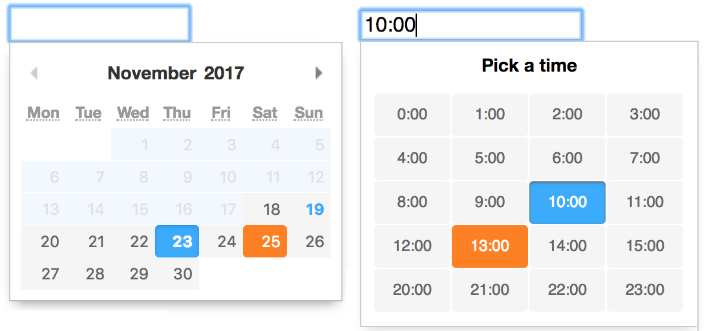

# Appointment Picker

A lightweight, accessible and customizable javascript timepicker widget. Accessibility is based on ARIA properties and keyboard support. The styling is kept simple and can be easily modified.

## Advantages
 - no dependencies
 - tiny (6KB minified, 2KB gzipped)
 - can be used with or without jQuery
 - styling is easy to change
 - comes in 2 variations
 
<a href="https://jannicz.github.io/appointment-picker/">
  <strong>See Appointment-Picker Demo and Examples</strong>
</a>

<p>
  
</p>

## Usage
Import both the stylesheet and the script
```html
<link rel="stylesheet" href="css/appointment-picker.css">
<script src="js/appointment-picker.js"></script>
```

### Use as jQuery plugin

If you would like to use the appointment-picker as a jQuery plugin add following code before initializing
```javascript
// To use appointmentPicker as jQuery plugin
$.fn.appointmentPicker = function(options) {
  this.appointmentPicker = new AppointmentPicker(this[0], options);
  return this;
};
```

Now you can initialize the picker on any text input field
```html
<input id="time-1" type="text">
```
```javascript
var $picker = $('#time-1').appointmentPicker();
```

### Use without any dependency
If you don't want any dependency, you can initialize the picker just like that
```html
<input id="time-2" type="text" value="10:00">
```
```javascript
var picker = new AppointmentPicker(document.getElementById('time-2'), {});
```

## Options
The appointment-picker can be configured with options
- `interval` sets the interval between appointments in minutes (`1-60`), if this number gets lower (more possible appointments) the picker will get longer
- `mode` the picker can be used in standard `24h` hour mode or in `12h` mode - the latter uses am/pm postfix
- `minTime` sets the minimum hour that can be picked, default is `0` what is eqivalent to 12am
- `maxTime` sets the maximum hour that can be picked, default is `24`
- `startTime` hides all appointments below this hour, default is `0`
- `endTime` hides all appointments above this hour, default is `24`
- `disabled` array of disabled appointments, i.e. `['10:30', '1:15pm', ...]` - these times cannot be selected or entered and will be skipped using the keyboard arrows
- `large` increasesthe size of the picker and the appointments by setting a `is-large` modifier
- `static` if true, the picker gets rendered on initialization into the dom, open/close events are not registered, the picker is always visible ([see demo](https://jannicz.github.io/appointment-picker/example/render-on-init.html))
- `title` defines the picker's heading

__Note:__ with `startTime` and `endTime` appointment hours can be visually removed. If startTime is greater than minTime a lower time can still be manually set via the keyboard. On the other hand the picker does not accept lower hours than `minTime` and higher than `maxTime`. Manually entered times outside of the defined bounds will be rejected by the picker, no extra validation is therefore needed ([Demo](https://jannicz.github.io/appointment-picker/example/form-submit.html)). Entering an empty string into the input resets the time.

Pass the options into the the AppointmentPicker call or the jQuery plugin call
```javascript
var picker = new AppointmentPicker(document.getElementById('time-2'), {
  interval: 30,
  mode: '12h',
  minTime: 09,
  maxTime: 22,
  startTime: 08,
  endTime: 24,
  disabled: ['16:30', '17:00'],
  large: true
});

// With jQuery
$('#time-1').appointmentPicker({
  interval: 15
});
```

## Methods
The appointment-picker exposes several functions to change its behaviour from outside ([see this demo](https://jannicz.github.io/appointment-picker/example/exposed-functions.html)). You can both use it with or without jQuery. While using jQuery always remember to add `$pickerReference.appointmentPicker.functionName()` to your picker reference.

To get the current time programatically from a picker instance use
```javascript
// without jQuery
picker.getTime();
// or access the picker instance of the jQuery object
$picker.appointmentPicker.getTime(); // i.e. { h: 15, m: 30 }
```

To programatically open a picker instance call
```javascript
picker.open();
```

To set a time of a picker instance
```javascript
picker.setTime('10:30');
```

To close it
```javascript
picker.close();
```

To destroy the picker instance and remove both the markup and all event listeners
```javascript
picker.destroy();
```

## Events
Appointment-picker exposes an event for hooking into the functionality. The event `change.appo.picker` contains a property `time` and is triggered on each successful value change ([see event demo](https://jannicz.github.io/appointment-picker/example/exposed-functions.html))
```javascript
document.body.addEventListener('change.appo.picker', function(e) { var time = e.time; }, false);
```

## Styling
All appointment-picker styles are namespaced with `.appo-picker`, i.e. `.appo-picker-list-item`. Depending on your project, you can either overwrite them using your own CSS or by modifying the provided CSS.

## Best practices
- appointment-picker neither installs anyevent listeners outside of the input nor it adds any dom elements until it is opened by the user
- it can be destroyed using its the exposed destroy method that causes all event listeners and dom elements to be removed (i.e. if used in a single page application)

## AMD / CommonJS wrapper
Appointment-Picker supports AMD and CommonJS import
```javascript
if (typeof exports === 'object') {
  module.exports = factory(root);
} else if (typeof define === 'function' && define.amd) {
  define('appointment-picker', [], function () {
    return factory(root);
  });
} else {
  root.AppointmentPicker = factory(root);
}
```

## Browser Support
- Chrome
- Firefox
- Safari
- Edge

## Datepair Plugin Example

You can combine this timepicker plugin with PikaDay to have a date time pair combo with similar look & feel:



Link to Pikaday: https://github.com/dbushell/Pikaday

## Author & License
- Jan Suwart | MIT License
